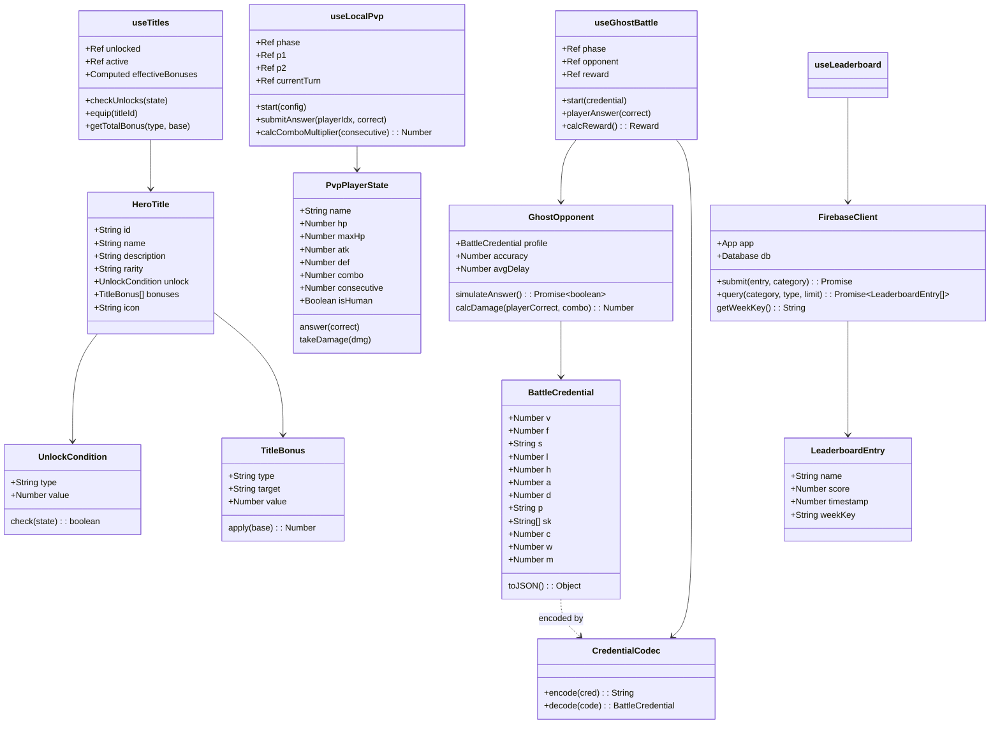
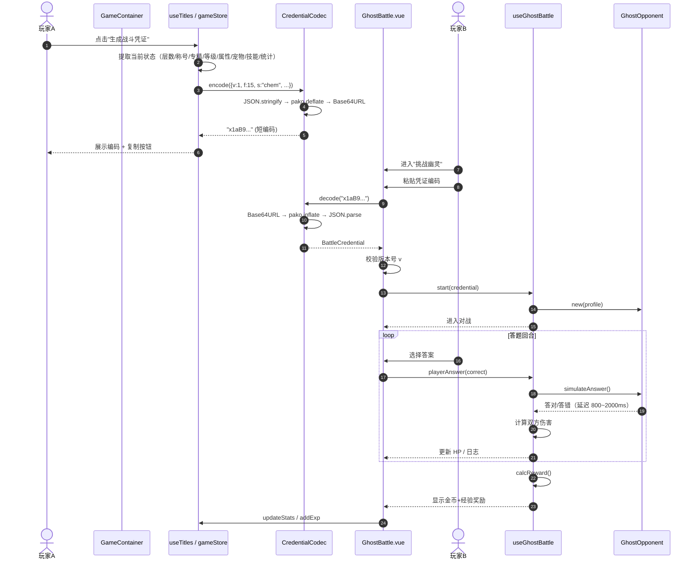
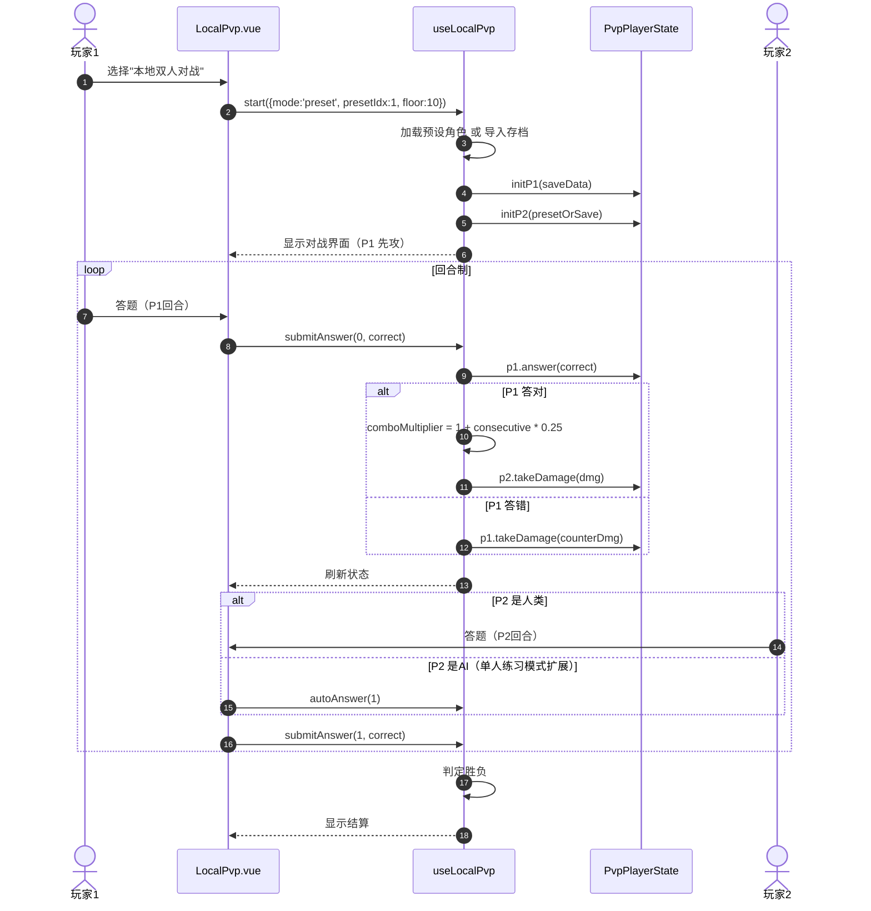
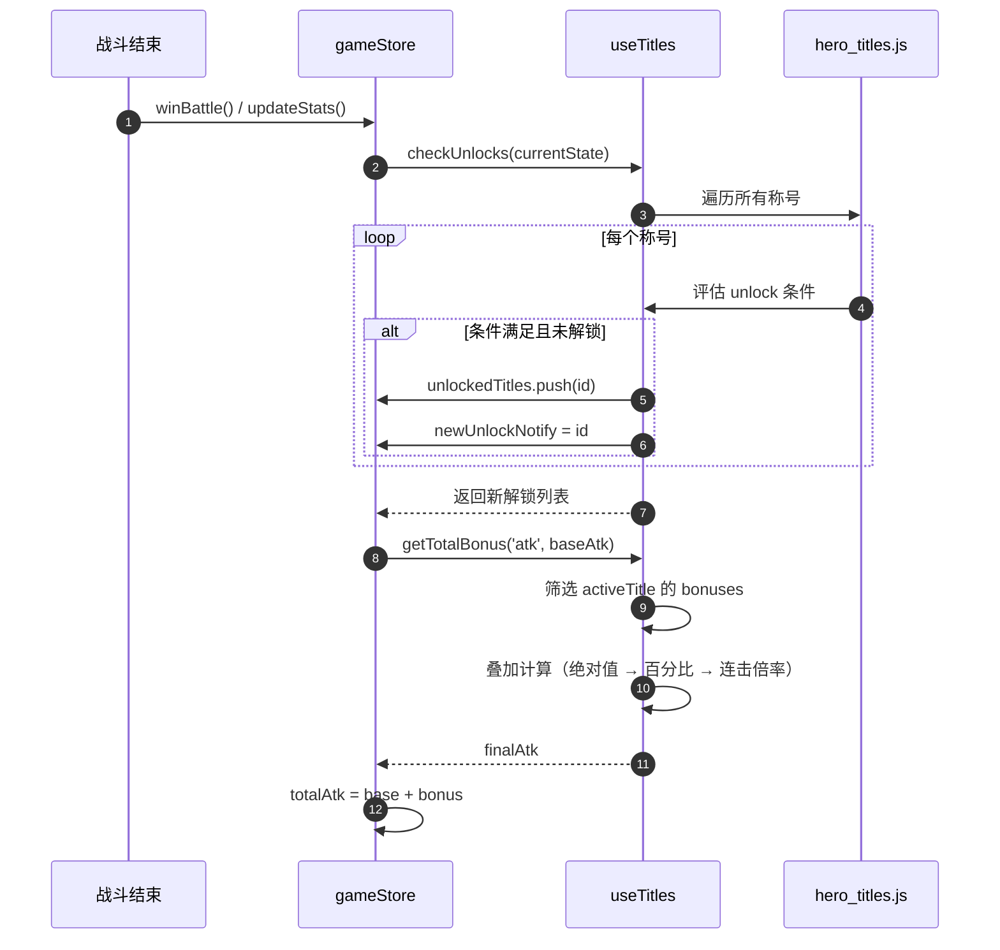

# 生化易界 · PVP对战 + 称号系统 + 排行榜 架构设计文档

> 版本：v1.0  
> 作者：架构师 · 高见远  
> 日期：2026-06-07  
> 范围：异步幽灵对战 / 本地双人对战 / 称号系统 / Firebase 全球排行榜

---

## Part A：系统架构设计

### 1. 实现方案与框架选型

#### 1.1 核心技术挑战

| 挑战 | 方案 | 理由 |
|------|------|------|
| 凭证编码需短（80~150字符） | JSON → pako.deflate → Base64URL，字段名单字母缩写 | pako 压缩比高，Base64URL 安全无填充；单字母字段进一步缩短 |
| 首屏包体积控制 | pako 动态 import()，Firebase 按需初始化 | 避免对战模块阻塞主游戏加载 |
| 纯前端无后端，PVP 数据可信 | 仅共享“快照”凭证，不共享实时状态；AI 模拟对方行为 | 牺牲实时性换取零后端成本 |
| Firebase 网络不可用容错 | 所有 API 包裹 try/catch，失败降级为本地模式 | 保证离线可玩 |
| 称号增益实时生效 | 通过 Pinia computed / getter 层统一计算最终属性 | 切换称号时自动重算，不侵入战斗核心 |
| 本地双人对战同屏 | 独立 Vue 组件，内部维护双玩家状态机 | 避免污染单人模式状态 |

#### 1.2 新增依赖包

```bash
npm install pako firebase
```

- **pako** (`^2.x`)：gzip 压缩/解压，浏览器端体积约 25KB（gzipped），动态导入后不影响首屏。
- **firebase** (`^11.x`)：Realtime Database 客户端。Spark 计划免费额度足够（并发 100、存储 1GB、流量 10GB/月）。

#### 1.3 架构模式

保持现有 **Pinia + Vue3 Composition API** 风格：
- **数据层**：`src/data/` 存放静态数据表（称号表、PVP 预设角色）。
- **逻辑层**：`src/composables/` 存放可复用逻辑（useGhostBattle、useLocalPvp、useTitles、useLeaderboard）。
- **表现层**：`src/components/` 新增独立 Vue 组件，尽量不复用 Battle.vue 内部逻辑，而是通过 props/events 与 Battle.vue 并行存在。
- **状态层**：扩展现有 `stores/game.js`，新增 `heroTitles`、`pvp` 相关 state，原有单人状态保持不动。

---

### 2. 文件列表

#### 2.1 新增文件

```
src/
  data/
    hero_titles.js          # 称号定义表（含解锁条件、增益、稀有度）
    pvp_presets.js          # 本地PVP预设角色（3组）
  utils/
    battleCredential.js     # 战斗凭证编码/解码（pako + Base64URL）
    firebase.js             # Firebase 初始化与 RTDB 实例
    leaderboard.js          # 排行榜读写封装（含容错降级）
  composables/
    useTitles.js            # 称号系统逻辑（解锁检查、增益计算、切换）
    useLeaderboard.js       # 排行榜逻辑（提交、查询、周榜计算）
    useGhostBattle.js       # 异步幽灵对战逻辑（AI模拟、结算）
    useLocalPvp.js          # 本地双人对战逻辑（回合制、连击、胜负）
  components/
    PvpLobby.vue            # PVP 大厅（选择幽灵对战/本地对战/排行榜）
    GhostBattle.vue         # 幽灵对战界面（输入凭证、对战、结算）
    LocalPvp.vue            # 本地双人对战界面
    TitleSystem.vue         # 称号面板（列表、切换、增益预览）
    Leaderboard.vue         # 排行榜界面（全球/周榜、三条赛道）
```

#### 2.2 修改文件

```
src/
  stores/
    game.js                 # 扩展：称号状态、PVP统计、排行榜本地缓存
  components/
    GameContainer.vue       # 添加PVP入口卡片、称号/排行榜面板挂载点
    App.vue                 # 添加全局Firebase初始化守卫（可选）
    TitleScreen.vue         # 版本号更新、新功能提示
package.json              # 新增 pako、firebase 依赖
vite.config.js            # 建议配置 chunk split，将 pako/firebase 拆为独立 chunk
```

---

### 3. 数据结构与接口（Class Diagram）



---

### 4. 程序调用流程（Sequence Diagram）

#### 4.1 凭证生成 → 分享 → 解码 → 对战



#### 4.2 本地双人对战流程



#### 4.3 称号解锁与增益生效



#### 4.4 排行榜提交与查询

```mermaid
sequenceDiagram
    autonumber
    participant GC as GameContainer
    participant UL as useLeaderboard
    participant LB as leaderboard.js
    participant FB as FirebaseClient
    participant RTDB as Firebase RTDB

    GC->>UL: 打开排行榜
    UL->>LB: query('maxFloor', 'global', 50)
    LB->>FB: getLeaderboardRef('maxFloor/global')
    FB->>RTDB: orderByValue().limitToLast(50).once('value')
    RTDB-->>FB: 数据快照
    FB-->>LB: 条目数组
    LB-->>UL: LeaderboardEntry[]
    UL-->>GC: 渲染榜单

    GC->>UL: 切换周榜
    UL->>LB: query('maxFloor', 'weekly', 50)
    LB->>LB: weekKey = getISOWeek()
    LB->>FB: 查询 .../weekly/{weekKey}/maxFloor
    FB->>RTDB: 同上
    RTDB-->>FB: 数据
    FB-->>LB-->>UL-->>GC: 周榜数据

    note over GC,RTDB: 战斗/捕捉后自动提交
    Store->>LB: submitIfHighScore('maxFloor', playerName, floor)
    LB->>FB: 读取当前玩家最高分
    FB->>RTDB: 事务读取
    RTDB-->>FB: 旧分数
    alt 新分数 > 旧分数
        FB->>RTDB: 写入新分数
        RTDB-->>FB: 成功
    end
    FB-->>LB: 结果
```

---

### 5. 待明确事项（技术决策与假设）

| # | 问题 | 当前假设 / 决策 |
|---|------|----------------|
| 1 | Firebase 项目配置如何分发 | 将 `firebaseConfig` 写入 `src/utils/firebase.js`（公钥模式，Spark 计划无后端密钥风险）。若需保密，改用环境变量 + CI 注入。 |
| 2 | 玩家名称如何确定 | 排行榜使用 `gameStore.title`（如"李时珍"）作为默认名称，玩家可在设置面板修改 `playerName`。 |
| 3 | 称号增益是否叠加 | **不叠加**：仅当前激活称号生效。避免数值爆炸，保持平衡。 |
| 4 | 幽灵对战奖励数值 | 假设：经验 = 对手层数 × 10，金币 = 对手层数 × 5。胜利额外加成 50%。需 PM 确认。 |
| 5 | 本地 PVP 连击上限 | 连击倍率封顶 ×2.5（10连击），防止一击秒杀。需 PM 确认。 |
| 6 | 凭证版本兼容性 | 凭证字段 `v` 为版本号。当前 v=1。未来若扩展，decode 时兼容旧版本。 |
| 7 | 排行榜防刷 | 纯前端无法完全防刷。采用客户端限速（同一设备 5 分钟内只提交一次同一赛道）。Spark 计划无 Cloud Functions，无法做服务端校验。 |
| 8 | 周榜 ISO 周定义 | 采用 `YYYY-Www` 格式（如 `2026-W23`），每周一 00:00 UTC 重置。 |

---

## Part B：任务分解

### 6. 依赖包列表

```bash
# 生产依赖
npm install pako firebase

# 开发依赖（无需新增，保持现有 vite/vitest/pinia/vue）
```

- `pako@^2.1.0`：凭证压缩/解压
- `firebase@^11.0.0`：Realtime Database 客户端

---

### 7. 任务列表（按依赖排序）

#### T01：项目基础设施

| 属性 | 内容 |
|------|------|
| **Task ID** | T01 |
| **任务名称** | 项目基础设施与依赖安装 |
| **Source Files** | `package.json`, `vite.config.js`, `src/main.js`, `.env.example` |
| **Dependencies** | 无 |
| **Priority** | P0 |
| **验收标准** | ① `npm install pako firebase` 成功；② `vite.config.js` 配置 `manualChunks` 将 `pako` 和 `firebase` 拆分为独立 chunk；③ `src/main.js` 预留 Firebase 初始化调用点（延迟到首次需要时）；④ `.env.example` 提供 Firebase 配置模板；⑤ 项目可正常 `npm run dev` |

#### T02：数据层与状态扩展

| 属性 | 内容 |
|------|------|
| **Task ID** | T02 |
| **任务名称** | 数据表、工具函数与 Pinia 状态扩展 |
| **Source Files** | `src/data/hero_titles.js`, `src/data/pvp_presets.js`, `src/utils/battleCredential.js`, `src/utils/firebase.js`, `src/utils/leaderboard.js`, `src/stores/game.js` |
| **Dependencies** | T01 |
| **Priority** | P0 |
| **验收标准** | ① `hero_titles.js` 包含至少 12 个称号，覆盖 4 种稀有度，定义完整解锁条件和增益；② `pvp_presets.js` 包含 3 组预设角色（不同专精/层数）；③ `battleCredential.js` 实现 `encode/decode`，输出长度 80~150 字符，含版本号校验；④ `firebase.js` 初始化 RTDB 实例，网络失败不抛未捕获异常；⑤ `leaderboard.js` 封装 `submit` / `query` / `getWeekKey`；⑥ `game.js` 新增 `unlockedTitles`、`activeTitleId`、`pvpStats`、`playerName` 等 state 及持久化逻辑 |

#### T03：称号与排行榜系统

| 属性 | 内容 |
|------|------|
| **Task ID** | T03 |
| **任务名称** | 称号系统与排行榜 UI + 逻辑 |
| **Source Files** | `src/composables/useTitles.js`, `src/composables/useLeaderboard.js`, `src/components/TitleSystem.vue`, `src/components/Leaderboard.vue` |
| **Dependencies** | T02 |
| **Priority** | P1 |
| **验收标准** | ① `useTitles` 提供 `checkUnlocks`、`equipTitle`、`getEffectiveStats` 方法；② 战斗结束后自动触发称号解锁检查，新称号弹出通知；③ `TitleSystem.vue` 展示称号列表（含锁定/解锁状态）、增益预览、切换按钮；④ `useLeaderboard` 提供 `refresh`、`submitScore`、`switchTab` 方法；⑤ `Leaderboard.vue` 展示全球/周榜切换、三条赛道（最高楼层/最高等级/最多捕捉）、前三名金银铜冠特效；⑥ 排行榜数据可正常读写 Firebase（在线）或提示离线（断网） |

#### T04：PVP 对战系统核心

| 属性 | 内容 |
|------|------|
| **Task ID** | T04 |
| **任务名称** | 幽灵对战与本地双人对战实现 |
| **Source Files** | `src/composables/useGhostBattle.js`, `src/composables/useLocalPvp.js`, `src/components/PvpLobby.vue`, `src/components/GhostBattle.vue`, `src/components/LocalPvp.vue` |
| **Dependencies** | T02 |
| **Priority** | P1 |
| **验收标准** | ① `useGhostBattle` 实现完整的回合循环：玩家答题 → AI 模拟答题（延迟 800~2000ms，正确率取自凭证中的历史正确率）→ 双方伤害计算 → 胜负判定；② `GhostBattle.vue` 支持输入凭证、解码校验、对战展示、结算弹窗；③ `useLocalPvp` 实现回合制状态机（P1回合→P2回合→...）、连击倍率（×1.0/×1.25/×1.5，封顶×2.5）、答错立即反击；④ `LocalPvp.vue` 支持预设角色选择、楼层选择（1~30）、同屏双玩家答题界面、中途退出；⑤ `PvpLobby.vue` 提供三个入口：幽灵对战、本地对战、排行榜；⑥ 两种对战模式均不修改 Battle.vue |

#### T05：主界面集成与最终调试

| 属性 | 内容 |
|------|------|
| **Task ID** | T05 |
| **任务名称** | 主界面集成、入口挂载与最终调试 |
| **Source Files** | `src/components/GameContainer.vue`, `src/App.vue`, `src/components/TitleScreen.vue` |
| **Dependencies** | T03, T04 |
| **Priority** | P0 |
| **验收标准** | ① `GameContainer.vue` 主界面新增「PVP竞技场」和「称号殿堂」入口卡片；② settings 面板新增「称号」tab 和「排行榜」入口；③ `GameContainer.vue` 的条件渲染正确挂载 `PvpLobby`、`TitleSystem`、`Leaderboard` 组件；④ `App.vue` 确保全局异常边界捕获 Firebase 错误；⑤ `TitleScreen.vue` 版本号更新（如 v5.0），并展示新功能公告；⑥ 全流程手动走查：生成凭证 → 复制 → 挑战 → 结算 → 称号解锁 → 排行榜提交 → 查看榜单 |

---

### 8. 共享知识（跨文件约定）

```
1. 凭证数据格式版本号
   - 当前版本 v=1
   - 字段单字母缩写：v(版本), f(层数), s(专精), l(等级), h(HP), a(ATK), d(DEF),
     p(宠物摘要), sk(技能列表), c(总正确数), w(总错误数), m(最大连击)
   - 解码时若 v 不匹配，提示"凭证版本过旧，请重新生成"

2. 称号增益计算顺序（优先级从高到低）
   - Step 1: 绝对值加成 (+5 ATK 等)
   - Step 2: 百分比加成 (+10% ATK 等)
   - Step 3: 连击伤害加成（仅战斗内连击时）
   - Step 4: 宠物加成（现有逻辑，称号加成在宠物之前）
   - Step 5: 经验加成（仅结算时）

3. 排行榜赛道标识符
   - 'maxFloor'    : 最高楼层
   - 'maxLevel'    : 最高等级
   - 'totalCaptures': 最多捕捉（图鉴 monsters 数量）

4. Firebase RTDB 路径约定
   - 全球榜: /leaderboard/global/{category}/{playerId}
   - 周榜:   /leaderboard/weekly/{weekKey}/{category}/{playerId}
   - playerId 使用 localStorage 中持久化的 uuid，首次启动时生成

5. 对战模式状态机（扩展 gameMode）
   - GAME_MODE.PVP_LOBBY = 'pvp_lobby'
   - GAME_MODE.GHOST_BATTLE = 'ghost_battle'
   - GAME_MODE.LOCAL_PVP = 'local_pvp'
   - 互斥组 COMBAT_MODES 新增 GHOST_BATTLE、LOCAL_PVP

6. 错误降级策略
   - Firebase 任何读写失败：console.warn + toast 提示"网络异常，排行榜功能暂不可用"
   - pako 动态导入失败：降级为 JSON.stringify + Base64（长度增加但功能可用）
   - 凭证解码失败：提示"无效的战斗凭证"

7. 本地 PVP 伤害公式（与单人模式保持一致）
   - 基础伤害 = max(ATK * 0.3, ATK * multiplier - DEF * 0.5)
   - 连击倍率 = 1 + consecutive * 0.25（封顶 1.5 倍，即 consecutive ≥ 2）
   - 答错时对方立即反击，使用对方 ATK 计算

8. 命名规范
   - 新增 composables 统一使用 camelCase 前缀 useXxx
   - 新增 Vue 组件统一使用 PascalCase
   - 数据表常量使用 UPPER_SNAKE_CASE
```

---

### 9. 任务依赖图

```mermaid
graph TD
    T01[\"T01: 项目基础设施\"] --> T02[\"T02: 数据层与状态扩展\"]
    T02 --> T03[\"T03: 称号与排行榜系统\"]
    T02 --> T04[\"T04: PVP 对战系统核心\"]
    T03 --> T05[\"T05: 主界面集成与调试\"]
    T04 --> T05

    style T01 fill:#4ecdc4,color:#1a1a2e
    style T02 fill:#4ecdc4,color:#1a1a2e
    style T03 fill:#d4a853,color:#1a1a2e
    style T04 fill:#d4a853,color:#1a1a2e
    style T05 fill:#ff6b6b,color:#fff
```

---

## 附录：关键数据结构详细定义

### A.1 称号表条目（hero_titles.js）

```javascript
{
  id: 'title_id',
  name: '称号名称',
  description: '描述文本',
  rarity: 'common' | 'rare' | 'epic' | 'legendary',
  icon: '🏅',
  unlock: {
    type: 'maxFloor' | 'maxComboInBattle' | 'uniqueMonstersCaught' | 'totalWins',
    value: 15
  },
  bonuses: [
    { type: 'flat', target: 'atk', value: 5 },      // 绝对值
    { type: 'percent', target: 'atk', value: 0.1 },  // 10%
    { type: 'combo', target: 'damage', value: 0.2 }, // 连击额外20%
    { type: 'pet', target: 'all', value: 0.15 },     // 宠物加成+15%
    { type: 'exp', target: 'exp', value: 0.2 }       // 经验+20%
  ]
}
```

### A.2 战斗凭证（battleCredential.js）

```javascript
// 编码前对象（单字母缩写）
{
  v: 1,           // version
  f: 15,          // floor
  s: 'chem',      // specialization
  l: 12,          // level
  h: 200,         // maxHp
  a: 35,          // atk (含装备)
  d: 18,          // def (含装备)
  p: '火灵·Lv3',  // pet summary
  sk: ['暴击', '回血'], // skills
  c: 128,         // totalCorrect
  w: 12,          // totalWrong
  m: 5            // maxCombo
}
```

### A.3 本地 PVP 配置

```javascript
{
  mode: 'preset' | 'import',
  presetIdx: 0,      // 仅 preset 模式
  importData: {},    // 仅 import 模式（存档 JSON）
  floor: 10,         // 1~30
  firstTurn: 0       // 0=P1先攻, 1=P2先攻
}
```

### A.4 排行榜条目（RTDB 存储格式）

```javascript
{
  name: "玩家名称",
  score: 25,         // 根据赛道类型：楼层/等级/捕捉数
  timestamp: 1717756800000,
  weekKey: "2026-W23" // 仅周榜
}
```

---

> 本文档已同步生成 Mermaid 子图：
> - `docs/class-diagram.mermaid`
> - `docs/sequence-diagram.mermaid`
